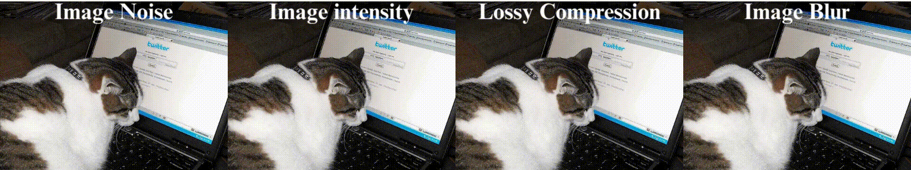

# Evaluating the Performance of Open-Vocabulary Object Detection in Low-quality Image

  

## Description

Dou to the scarcity of suitable image dataset online related to low-quality image, we created a new set of datasets for this study.  Low-quality image dataset is based on the MS COCO 2017 validation images, with images processed into four categories, including lossy compression, image intensity, image noise and image blur.  In total, the dataset comprises 100,000 processed images and is modified by humans to ensure that images are valid in the real world.

## Open-source resource

Everyone can download the dataset from [Kaggle](https://www.kaggle.com/datasets/pochihwu/low-quality-image-dataset) and [Google Drive](https://drive.google.com/file/d/1-w432b79T6Tj_bhkrFal_fVVLC4eE79t/view?usp=drive_link).

If you would like to create your own low-quality images, you can use our image processing code available on [Github](https://github.com/pochih-code/Low-quality-image-dataset/tree/main/image%20processing).
 

  

## Feedback
We sincerely welcome any feedback on this dataset. Please contact the authors by sending an email to

`pochihwu1118 at gmail.com`.

## License

This project is open-sourced under the MIT License. 
You are free to use, modify, and distribute the dataset and associated code. 
For full details, please refer to the included `LICENSE` file.